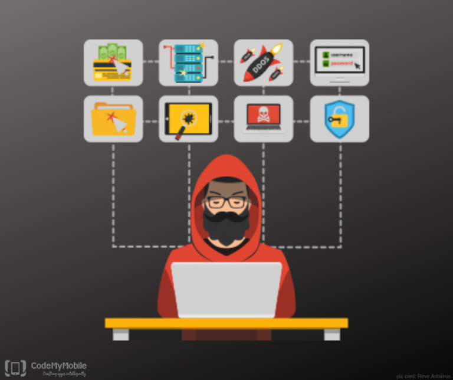
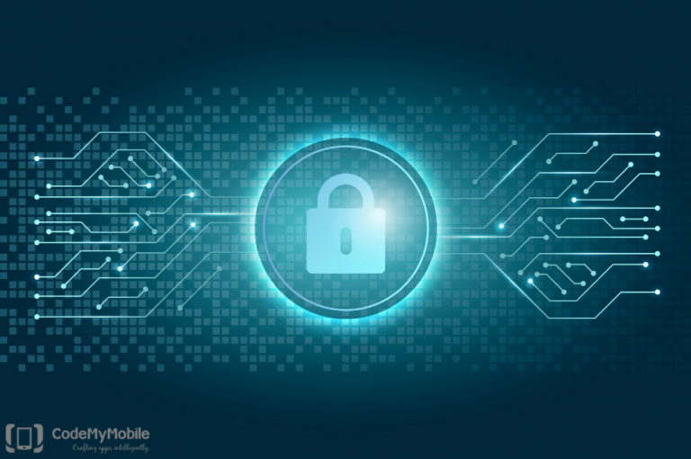

# Here’s What No One Tells You About Cybersecurity

Cybersecurity is the process of protecting technologies, systems, and networks from any kind of cyberthreat. Today, Cybercrime poses a threat to an individual’s security and an even bigger threat to international organizations, banks, and governments.
It’s a golden age to be a hacker with so many access points, public IPs, constant traffic and tons of data to exploit hackers are having one hell of time exploiting the vulnerabilities.
With so much data and a threat to it out there, cybersecurity has become essential.

## Conventional And Unconventional Type Of Cybersecurity Threats:

Most of the security products protect us from the known threats but they fall short when it comes to protecting from an unknown threat. Here’s a list of a few of those threats:

### Recycled Threats:
They are considered to be the most cost-effective method and that’s why it is chosen from time to time. Most of the security products have limited memory and security teams choose the most up-to-date threat to protect against, so when an older threat attempts to enter the network, it could bypass the security product because it is not categorized as something seen before.

### Modified Existing Code:
This method is slightly more expensive than Recycled Threats. Attackers take an existing threat and make slight modifications to it either manually or automatically, this results in a polymorphic malware or polymorphic URL, what this means is that the malware continuously morphs and changes itself.
If a security product detects the threat and creates protection for it then any slight change in the code will turn the threat into unknown and then it could bypass the security.

### Artificial Intelligence-based threats:
Security firms and researchers have been using machine-learning models, neural networks and other AI technologies for a while. It is highly likely that hackers are using the same technology to strike back. “Unfortunately, AI gives attackers the tools to get a much greater return on their investment” explains Steve Grobman, chief technology officer at McAfee. Hackers are likely to use AI to help design malware that’s even better at fooling sandboxes or security programs.

The danger from conventional threats is also not something to overlook, given below is a list of some of the common cybersecurity threats as explained by CISCO:

### Ransomware:
Ransomware is a type of malicious software. It is designed to extort money by blocking access to a file or computer system until the ransom is paid.

### Malware:
Malware is a type of software designed to gain unauthorized access or to cause damage to a computer.

### Social Engineering:
Social Engineering is a tactic that adversaries use to trick you into revealing sensitive information.

### Phishing:
Phishing refers to sending fraudulent emails that resemble emails from reputable sources with the aim of stealing sensitive data like credit card numbers.

## Think Cybersecurity Is Withering, Here’s Why You Might Be Wrong:

Cybersecurity might not seem like an emerging topic to some of you, given that it has been around for a while, but it is also evolving as much as other technologies. There are new ways that hackers are using to strike and at the same time, new ways are being developed to protect our systems.
Advancement in other technologies also lead to an increased cybersecurity threat, some of those advancements are hardware authentication, cloud technology, and deep learning.
Due to all these advancements, the number of cybersecurity jobs is growing 3 times faster than any other tech jobs however we are falling short when it comes to filling these jobs, as‌ ‌a‌ ‌result, it is predicted that we will have 3.5 million unfilled cybersecurity jobs by 2021.

## Where Does India Stand At Cybersecurity Threats:

India’s cybersecurity is a joke for hackers. Among 60 countries India is ranked 15th in cybersecurity, number 1 rank being the least secure and 60 the most.
Over the last year itself, the country has seen a series of cybercrimes. For instance, in July last year, an ATM scam in Kolkata wiped out over Rs20 lakh, in August, anonymous hackers bagged nearly Rs96 crore from the Pune-based Cosmos Bank.
According to the Global Risk Report, 2019 released by World Economic Forum(WEF) poor cybersecurity protocols resulted in the data breach of Aadhar IDs of more than 1.1 billion citizens.
Many apps in the market can compromise your security and unfortunately, India also has the third-highest rate of Bad App Installation.

## Some Mind-Boggling Facts About Cybersecurity!!

Below mentioned are some of the facts that might influence you to divert your attention towards the importance of cybersecurity:

Cybercriminals will steal an estimated 33 billion records in 2023.
- 24000 malicious mobile apps are blocked every day.
- 21% of the files are not protected in any way.
- In 2016 3 billion yahoo accounts were hacked in one of the biggest breaches of all time.
- In 2016 Uber reported that hackers stole the information of over 57 million riders and drivers.
- The industry with the highest number of ransomware attacks is the healthcare industry and the attacks are expected to quadruple by 2020.

## How To Protect Yourself From Cybercrime:

Ok, so after all this information about cybersecurity and cyber threats, you might be wondering about the ways to protect yourself from cybercrime, but here is the thing: You can’t.
You can, however, take precautions to help protect against it. Some of them are:

* Use a full-service Internet security suite: Buy a good real-time protection suite.
* Use strong passwords: Don’t repeat your passwords on different sites, change passwords regularly, make them lengthy.
* Keep your software updated: Keep your operating system and Internet security Software updated.
* Keep up-to-date on major security breaches: If you do business with a merchant or have an account on a website that’s been impacted by a security breach, find out what information the hackers accessed and change your password immediately
* Multi Factor Authentication: MultiFactor Authentication combines two or more independent credentials, for example, Password, Security token, and Biometric. The goal is to create a layered defense and make it more difficult for an unauthorized person to gain access.
* Protection against identity theft: Do not reveal too much information about yourself on social media or other websites. There is no reason to ever publicly disclose financial information.

Cybercrime shouldn’t be taken casually and all the preventive measures should be taken to protect yourself or your organization from it.
If you find yourself under any kind of cyber threat, it is best to immediately report to the cybercrime portal. If you are from India and want to report a cybercrime you can go to this website:
https://cybercrime.gov.in/cybercitizen/home.htm
Similarly, every country has its own portal for reporting cybercrime.

Did you find this blog helpful? If so, whom would you like to share it with?
