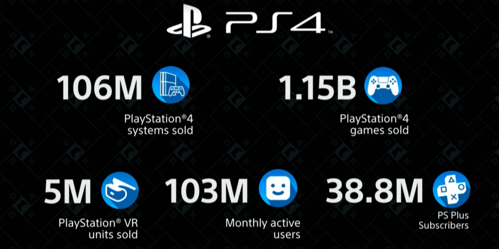
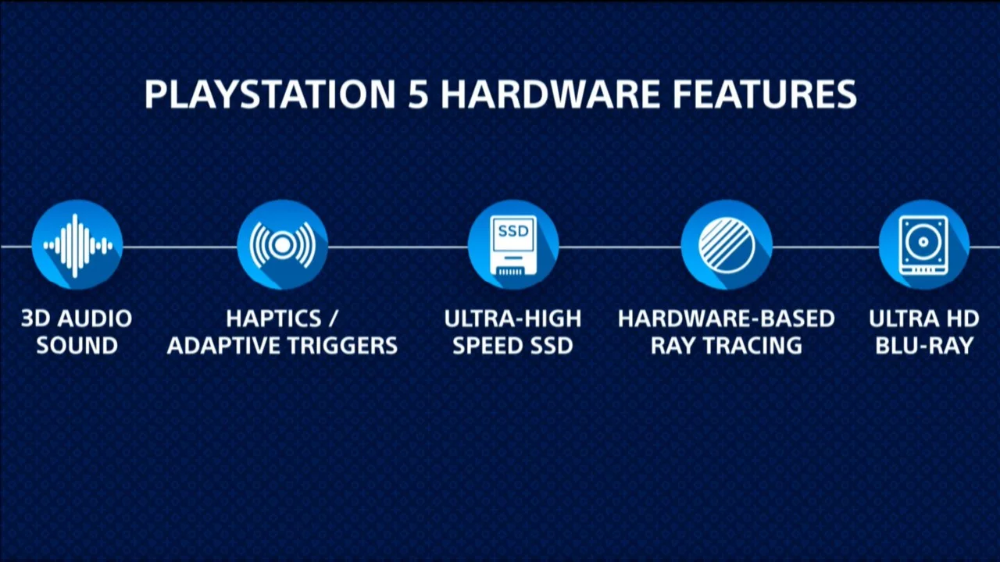

Geek? Gamer? Journalist? At some point of time, we all have thought of buying a PlayStation (or an Xbox, but let's be honest, whenever we think of a  gaming console, the first thing that comes to our minds is PlayStation) even though some of us we ended up not buying it because it always has been a load on the pocket (ouch).
Well, the good news is, Sony has just announced their new next-gen gaming console, named as ~drum roll~ PlayStation 5 or PS5, announced by Sony Interactive Entertainment CEO Jim Ryan at CES 2020.

The thing is, Sony didn't reveal a lot about PS5. And we'll let you know later why we're pissed off about it and why Sony might have done what they've done, but first, let's see the revealed information.
First, the logo. Yes, they revealed their new logo which looks exactly like their old one except for the numerical value (of course).

Then it was their sales figures. And to be honest, they were pretty impressive. PlayStation 4 is the second most successful PlayStation (after, PlayStation 2, of course, no one can beat that legend) and the fourth most successful gaming console ever (guess who tops the list? yup, the OG - PS2).
One interesting figure was that of 38.8M PS+ subscribers which could be a huge thing for PS5 because this clearly shows how strongly attached users are to this brand and their services.

Apart from all this, Sony revealed a few features which were very obvious because without these, we don't think any console would be ready for today’s market. Some of these features are:

- 3D Audio Sound
- Haptics/Adaptive Triggers
- Ultra-High-Speed SSD
- Hardware-Based Ray Tracing
- Ultra HD Blu-Ray

Missing from this list is backwards compatibility, which means - if the game made for an older version of PS would be able to run on PS5, which remains a bit of a question mark.

Oh, they also revealed when it is coming out, holidays 2020.

## Now, why are we pissed off?

### Our answer: Why shouldn't we be?

Well, let’s be honest, whatever Sony announced about the PlayStation 5, we all kind of knew it, we were all anticipating some big PlayStation 5 news. Microsoft has already had a big sort of unloading of information out a few weeks ago, so you think, well Sony has to react to that - just put some stuff out there, but it seems like Sony's pissing in their pants, they're petrified because they can't compete with Xbox, so they've decided not to release any information at all because they're trying to avoid comparisons, that's all we can conclude.
Maybe we’re being a little too facetious about this because, you know, maybe they want to sort of wait instead of pushing more information, because to launch, to get hyped, to get that snowball sort of effect going - leading up to the launch.

But come on, it's CES, the Consumer Electronics Show, nothing they talked about was a new consumer product, they patted themselves on the back about how well Playstations been doing over the last 8 years, like, “Yeah, we're awesome look how fantastic we are, wow look at these numbers, these are big numbers, we’ve been so successful” and then they announced nothing except for the new logo (it funny that they're calling it a new logo)

They didn't show off a single frame from a game, didn't talk about any upcoming games (except the expected few), didn't talk about any studio they're working with for, didn't show off the new controller which was one of the rumours floating around and everything else they spoke about was nothing to do with consumer stuff. For God's sake, they didn't even reveal its estimated price.

It was like, “Look how clever we are in Hollywood, we've got these fancy computer camera techniques that we can do, these special things with.” and it's got nothing to do with consumer stuff and then at the other end of it, they spent the entire rest of the thing just talking about how fancy their research and prototypes and not actual real products are.

So until Sony reveals everything about PS5, we won't know if it's gonna kick Xbox Series X off the porch or not because Xbox Series X is looking pretty rad right now and if Sony is unable to compete, we might soon see a new winner in the world of console gaming. (Go #TeamPC)
